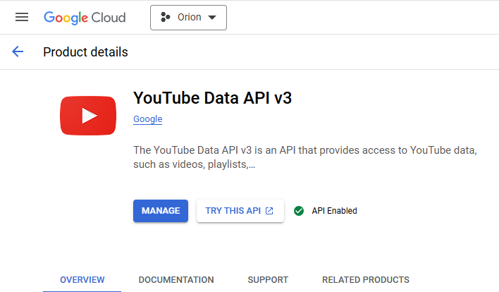

<h1 align="center">🌚 ORION</h1>

> <p align="center">a CLI tool for easy downloading songs & metadata (for example, you can use it with iTunes to make beautiful music library like I do)</p>

## 🍒 Preview


## ⚡️ Installation

### 💥 Dependencies

Make sure you have installed and added to $PATH

- FFmpeg (https://ffmpeg.org/)
- Node.js (https://nodejs.org/en)
- Git (optional, https://git-scm.com/)

### 🫧 Cloning application

You can download zip archive containing all source code from GitHub **OR** use

```shell
cd directory-you-want
git clone https://github.com/koniziwa/orion.git
```

### ☃️ Getting packages

As a next step, we are going to install yarn (because i love it, but you can use any package manager you want)

```shell
npm install -g yarn
```

Then you should move to **Orion** directory (folder)

```shell
cd directory-from-previous-step/orion
```

Finally, install all required packages using just one word

```shell
yarn
```

### 🌴 Setting API keys

To use the application, you must get API keys and bind them

- [ Genius ] Go to https://genius.com/api-clients, get into account, then click **Generate Access Token**, save it


- [ YouTube ] Go to https://console.cloud.google.com/apis/, get into account, create sample project, find and enable **YouTube Data API v3**, forward to **Credentials**, create **API key** using **Create credentials**, save API




We want to bind API to our application, let's do it

```shell
cd folder-where-you-have-orion/orion
node ./setAPI.js
```

Simply paste tokens you have

### ⭐️ Congratulations!

Now you have installed **Orion** on your device, just try it

```shell
node ./index.js
```
